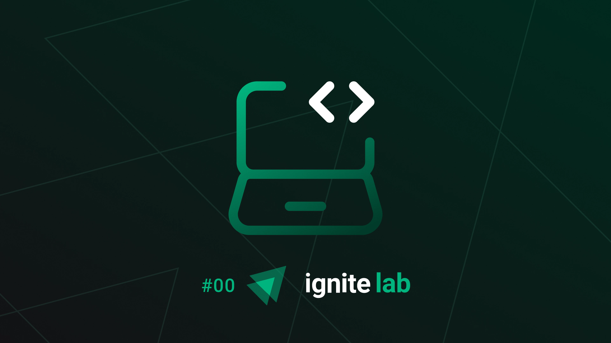

<h1 align="center">
   Ignite Lab#00
</h1>

  <a href="#computer-projeto">Projeto</a>&nbsp;&nbsp;&nbsp;|&nbsp;&nbsp;&nbsp;
  <a href="#rocket-tecnologias">Tecnologias</a>&nbsp;&nbsp;&nbsp;|&nbsp;&nbsp;&nbsp;
  <a href="#memo-licença">Licença</a>

 

  

 

  

 

## :computer: Projeto

Projeto desenvolvido durante o Ignite Lab da Rocketseat no intuito de estudar técnicas de Microserviços e GraphQL. 

## :rocket: Tecnologias

Esse projeto foi desenvolvido com as seguintes tecnologias:

- [ReactJS](https://react.dev)
- [Next.js](https://nextjs.org/)
- [TypeScript](https://www.typescriptlang.org/)
- [TailwindCSS](https://tailwindcss.com/)
- [Node.js](https://nodejs.org/en)
- [Kafka](https://kafka.apache.org/)
- [GraphQL](https://graphql.org/)
- [Apollo](https://www.apollographql.com/)

## :memo: Licença

Esse projeto está sob a licença MIT. Veja o arquivo [LICENSE](../../../LICENSE) para mais detalhes.

