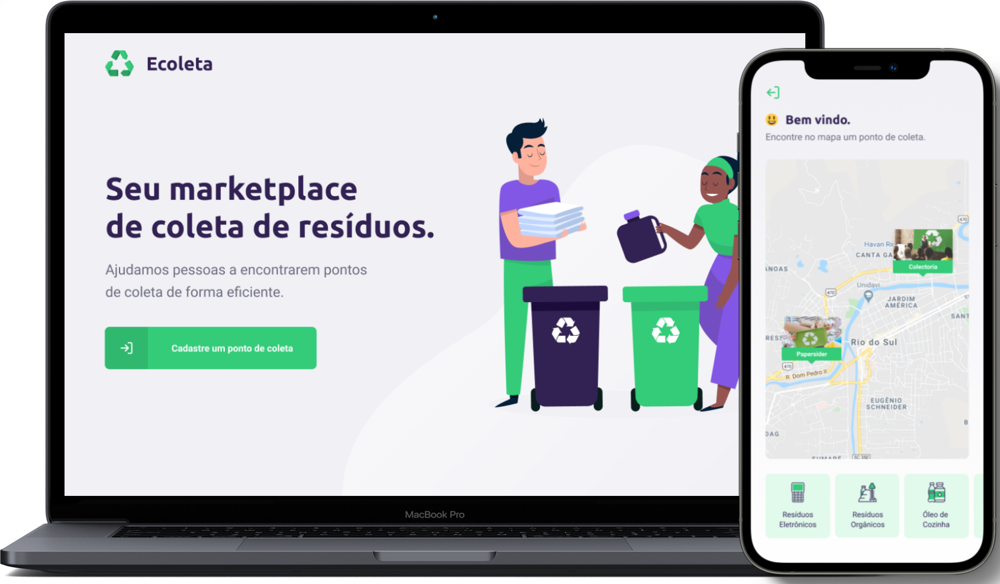

<h1 align="center">
    
</h1>

<p align="center">
  <a href="#-tecnologias">Tecnologias</a>&nbsp;&nbsp;&nbsp;|&nbsp;&nbsp;&nbsp;
  <a href="#-projeto">Projeto</a>&nbsp;&nbsp;&nbsp;|&nbsp;&nbsp;&nbsp;
  <a href="#-getting-started">Getting Started</a>&nbsp;&nbsp;&nbsp;|&nbsp;&nbsp;&nbsp;
  <a href="#memo-licença">Licença</a>
</p>

<p align="center">
 

  
</p>

<br/>

<p align="center">
  
</p>

<br/>

## 🚀 Tecnologias

Esse projeto foi desenvolvido com as seguintes tecnologias:

- [ReactJS](https://pt-br.reactjs.org/)
- [React Native](https://reactnative.dev/)
- [Expo](https://expo.dev/)
- [Node.js](https://nodejs.org/)
- [Express](https://expressjs.com/)
- [SQLite3](https://www.sqlite.org/index.html)

## 💻 Projeto

O Ecoleta é uma aplicação que visa ajudar pessoas a encontrarem pontos de coleta de resíduos de forma eficiente.

## ▶ Getting Started
### Requisitos:
Para rodar a aplicação, é necessário ter [Git](https://git-scm.com), [Node.js](https://nodejs.org/), [Yarn](https://yarnpkg.com/), [Expo](https://expo.dev/) e [SQLite3](https://sqlitebrowser.org/) previamente instalados.

### Rodando a aplicação:
```bash
# Primeiramente, clone o repositório
git clone https://github.com/lucianogmoraesjr/ecoleta-nlw1-omnistack.git

# Acesse a pasta da aplicação
cd /ecoleta-nlw1-omnistack/

# Instale as dependências dos repositórios server/, web/ e mobile/
yarn install

# Rode o server
yarn start

# Rode a aplicação web
yarn start

# Rode o mobile
expo start
```
Acesse a aplicação no seu browser em: localhost:3000

Acesse a API em: localhost:3333

## :memo: Licença

Esse projeto está sob a licença MIT. Veja o arquivo [LICENSE](LICENSE) para mais detalhes.

---

Projeto ministrado por [Diego Fernandes](https://github.com/diego3g), CTO na [Rocketseat](https://rocketseat.com.br/).
