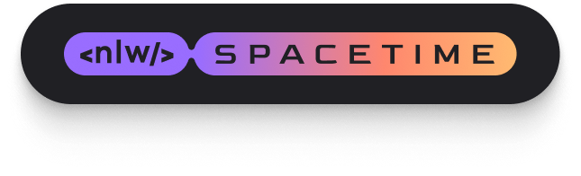
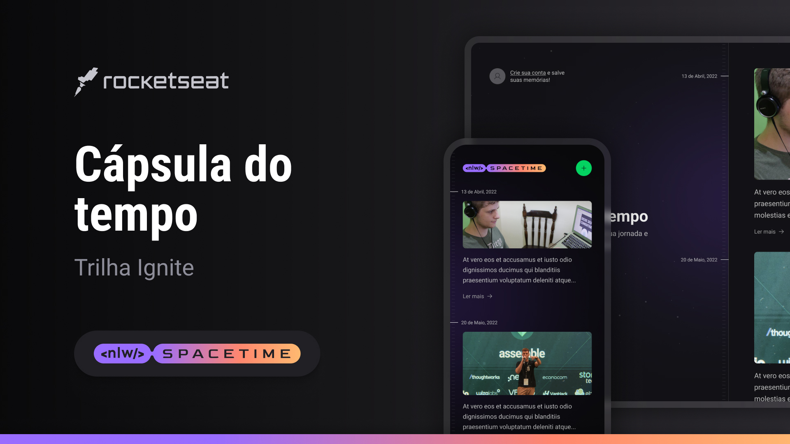

<h1 align="center">
  
</h1>

  <a href="#computer-projeto">Projeto</a>&nbsp;&nbsp;&nbsp;|&nbsp;&nbsp;&nbsp;
  <a href="#rocket-tecnologias">Tecnologias</a>&nbsp;&nbsp;&nbsp;|&nbsp;&nbsp;&nbsp;
  <a href="#art-layout">Layout</a>&nbsp;&nbsp;&nbsp;|&nbsp;&nbsp;&nbsp;
  <a href="#memo-licença">Licença</a>

 

  

 

  

 

## :computer: Projeto

Projeto desenvolvido durante os desafios #boraCodar da Rocketseat no intuito de estudar técnicas de front-end. 

## :rocket: Tecnologias

Esse projeto foi desenvolvido com as seguintes tecnologias:

- [ReactJS](https://react.dev)
- [Vite](https://vitejs.dev)
- [TypeScript](https://www.typescriptlang.org/)
- [Sass](https://sass-lang.com/)

## :art: Layout

Você pode visualizar o layout do projeto através [desse link no Figma](https://www.figma.com/community/file/1255887923488942888). É necessário ter conta no [Figma](https://figma.com) para acessá-lo.

## :memo: Licença

Esse projeto está sob a licença MIT. Veja o arquivo [LICENSE](../../../LICENSE) para mais detalhes.

