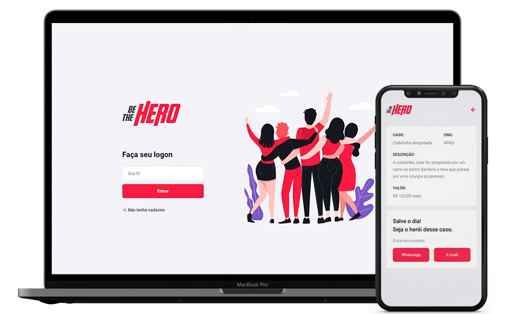

<h1 align="center">
    
</h1>

<p align="center">
  <a href="#-tecnologias">Tecnologias</a>&nbsp;&nbsp;&nbsp;|&nbsp;&nbsp;&nbsp;
  <a href="#-projeto">Projeto</a>&nbsp;&nbsp;&nbsp;|&nbsp;&nbsp;&nbsp;
  <a href="#-getting-started">Getting Started</a>&nbsp;&nbsp;&nbsp;|&nbsp;&nbsp;&nbsp;
  <a href="#memo-licença">Licença</a>
</p>

<p align="center">
 

  
</p>

<br/>

<p align="center">
  
</p>
<br/>

## 🚀 Tecnologias

Esse projeto foi desenvolvido com as seguintes tecnologias:

- [Node.js](https://nodejs.org/)
- [ReactJS](https://reactjs.org/)
- [React Native](https://facebook.github.io/react-native/)
- [Expo](https://expo.io/)

## 💻 Projeto

O Be The Hero é um projeto onde visa conectar pessoas que desejam contribuir monetariamente com ONGS (Organizações Não Governamentais) que necessitam de ajuda.

## ▶ Getting Started
### Requisitos:
Para rodar a aplicação, é necessário ter [Git](https://git-scm.com) e [Node.js](https://nodejs.org/).

### Rodando a aplicação:
```bash
# Primeiramente, clone o repositório
git clone https://github.com/lucianogmoraesjr/be-the-hero-omnistack-11.git

# Acesse a pasta da aplicação
cd be-the-hero-omnistack-11/

# Instale as dependências em /backend, /frontend e /mobile
npm install

# No /backend, rode as migrations
npx knex migrate:latest

# Rode o backend
npm start

# Rode o frontend
npm start

# Para rodar o mobile, é necessário instalar o Expo Client no seu smartphone e então rodar o comando
yarn start
```
## :memo: Licença

Esse projeto está sob a licença MIT. Veja o arquivo [LICENSE](LICENSE) para mais detalhes.

---

Projeto ministrado por [Diego Fernandes](https://github.com/diego3g), CTO na [Rocketseat](https://rocketseat.com.br/).
