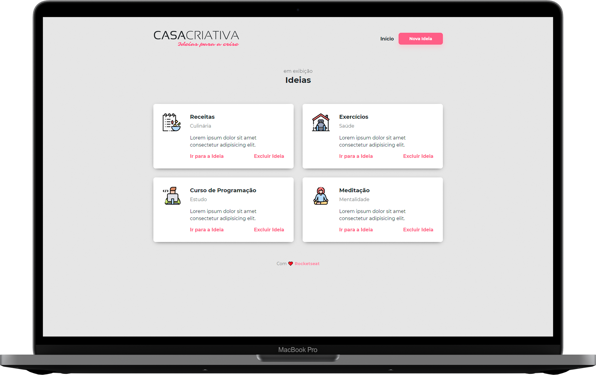

<h1 align="center">
    
</h1>

<p align="center">
  <a href="#-tecnologias">Tecnologias</a>&nbsp;&nbsp;&nbsp;|&nbsp;&nbsp;&nbsp;
  <a href="#-projeto">Projeto</a>&nbsp;&nbsp;&nbsp;|&nbsp;&nbsp;&nbsp;
  <a href="#-getting-started">Getting Started</a>&nbsp;&nbsp;&nbsp;|&nbsp;&nbsp;&nbsp;
  <a href="#memo-licença">Licença</a>
</p>

<p align="center">
 

  
</p>

<br/>

<p align="center">
  
</p>

<br/>

## 🚀 Tecnologias

Esse projeto foi desenvolvido com as seguintes tecnologias:

- [Node.js](https://nodejs.org/)
- [Express](https://expressjs.com/)
- [SQLite3](https://www.sqlite.org/index.html)
- [Nunjucks](https://mozilla.github.io/nunjucks/)

## 💻 Projeto

A Casa Criativa é uma aplicação onde as pessoas podem sugerir novas idéias de atividades para serem realizadas durante a quarentena do coronavírus 💜

## ▶ Getting Started
### Requisitos:
Para rodar a aplicação, é necessário ter [Git](https://git-scm.com), [Node.js](https://nodejs.org/) e [SQLite3](https://sqlitebrowser.org/) instalados.

### Rodando a aplicação:
```bash
# Primeiramente, clone o repositório
git clone https://github.com/lucianogmoraesjr/casa-criativa-wsdev-rocketseat.git

# Acesse a pasta da aplicação
cd casa-criativa-wsdev-rocketseat/

# Instale as dependências
npm install

# Rode a aplicação
npm run dev
```
Acesse a aplicação no seu browser em: localhost:3000

## :memo: Licença

Esse projeto está sob a licença MIT. Veja o arquivo [LICENSE](LICENSE) para mais detalhes.

---

Projeto ministrado por [Mayk Brito](https://github.com/maykbrito), instrutor na [Rocketseat](https://rocketseat.com.br/).
